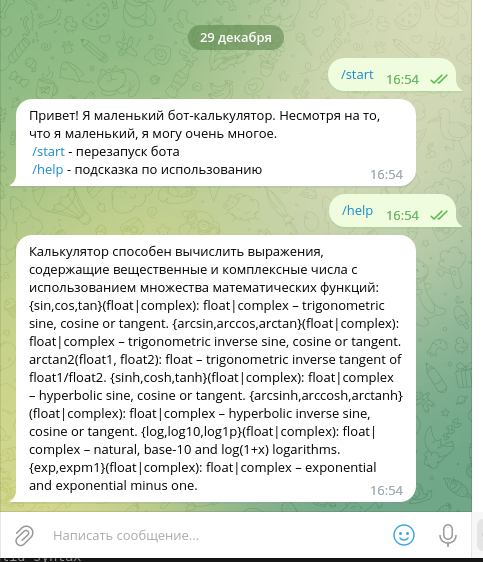
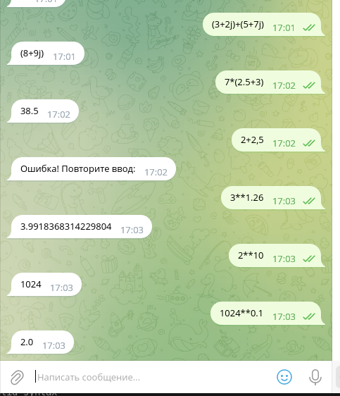

# Домашнее задание к семинару 9 по языку Python

Задание: Создать Телеграм бот - калькулятор для работы с рациональными и комплексными числами, организовать меню, добавив в неё систему логирования.

При создании программы было использовано виртуальное окружение и внешние библиотеки:
pytelegrambotapi,  memory_profiler, numexpr

Организовано меню, содержащее пункты /start, /help

Все сообщения пользователя сохраняются в файле log.
txt При ошибочном вводе в строки добавляется слово "Error".

После запуска бот доступен по ссылке  http://t.me/SMitroshin_myfirsttest_bot

Скриншоты программы:

